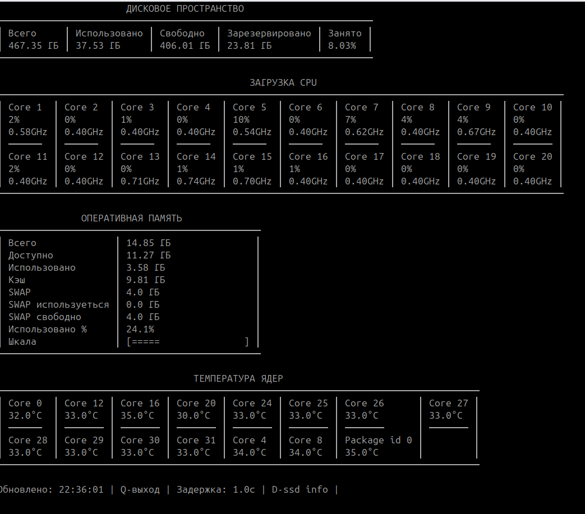

# System Monitor v 1.0.1

***

Скрипт выводит в консоль немного базовой информации о системе в режиме 
реального времени.
Собственно ничего необычного не делает, просто сделал чтобы интересующая меня
информация была в одном месть, и умещалась в одном окне в более менее понятном виде.
Скрипт не требует установки дополнительных зависимостей(кроме Python).




###  Сделать Python-скрипт запускаемым в Linux системе.

1. Сделать скрипт исполняемым

Добавить shebang-строку в начале файла (#!/usr/bin/env python3)

```
chmod +x system_monitor.py
```

2. Установка в систему

Переместите скрипт в одну из системных директорий (например, /usr/local/bin/):

```
sudo mv system_monitor.py /usr/local/bin/system_monitor
```

3. Теперь можно запускать из любого места:

```
system_monitor
```

### Создание desktop-файла (для запуска из GUI)

1. Создайте файл:

```
nano ~/.local/share/applications/system-monitor.desktop
```

2. Добавте содержимое

```
[Desktop Entry]
Version=1.0
Name=System Monitor
Comment=Мониторинг системы
Exec=/usr/local/bin/system_monitor
Icon=utilities-system-monitor
Terminal=true
Type=Application
Categories=System;Monitor;
```

Теперь ваш скрипт полностью готов к использованию в Linux системе!

### Скрип должен работать на большинстве дистрибутивов.

Скрипт скорее всего не будет работать:

- Минималистичные дистрибутивы (Alpine, Tiny Core Linux).
- Серверные/облачные образы.